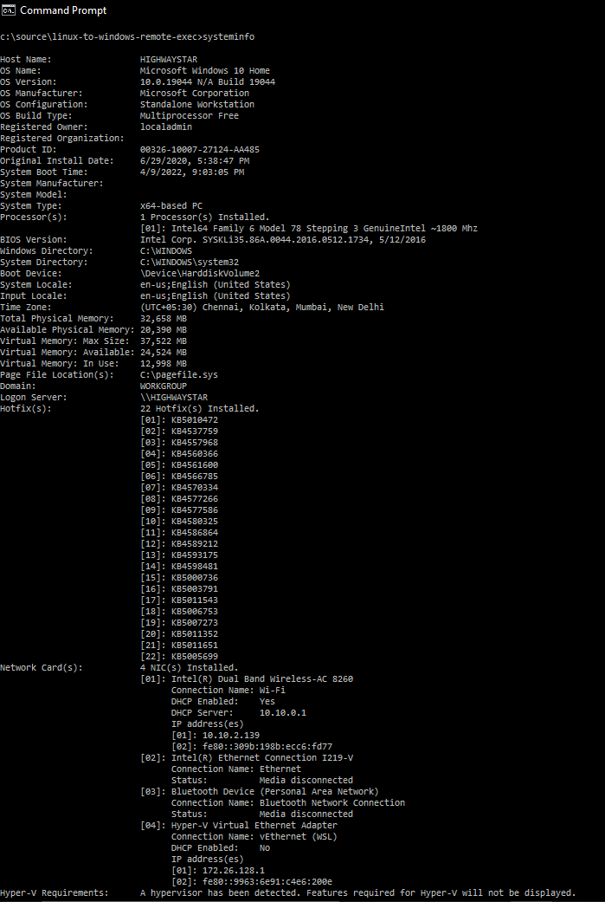

# Windows Commands

## SystemInfo

Most of the system information can be extracted by running the `systeminfo` command.

Notes:

- You can pipe the output to the `findstr` (similar to linux's `grep`) command to filter/extract the desired portion of the output.
- By default, the output of the command is in list format ([see example](./command-outputs/systeminfo-output-list.txt)). You can also use:
  - `systeminfo /FO CSV` to get the output in CSV format ([see example](./command-outputs/systeminfo-output-csv.csv)).
  - `systeminfo /FO TABLE` to get the output in tabular format ([see example](./command-outputs/systeminfo-output-table.txt)).
- To see the list of all available options, type `systeminfo /?`

## Installed Programs, OS Patches

A list of installed programs and OS patches can be extracted with either the `dism` or `wmic` commands. The `systeminfo` command too can be used, but will only list KB numbers.

The `wmic` command: This is the swiss-army knife of Windows management commands. It can be used to pretty much do anything you want.

- @TODO
- The output of the command can be formatted as CSV, table, or list. See [examples here](https://www.pearsonitcertification.com/articles/article.aspx?p=1700427&seqNum=4).
- To see the list of all available options, type `wmic /?`

The `dism` command:

- Running `dism /online /get-packages` command will list all packages installed on the system.
- Additional features of a package (if available) can be extracted by running `dism /online /get-features /packagename:<packagename>`
- By default, the output of the command is in list format ([see example](./command-outputs/dism-output-list.txt)). You can also dump the output in table format ([see example](./command-outputs/dism-output-table.txt)).
- To see the list of all available options, type `dism /?`

> Note: Running the `dism` command requires the admin to be running elevated.

## Services

The easiest/quickest way to get a list of running services is by running the `net start` command. However for a more detailed list, you can use the `sc` command.

Notes:

- The `sc query` and `sc queryex` commands will fetch the general running state of all the services.
- You can also query the details of a specific service as follows: `sc query <servicename>` or `sc queryex <servicename>`.
- The configuration details & description will have to be fetched on a per-service basis as follows:
  - The `sc qc <servicename>` command will dump configuration details of a service: name, display name, start type, path etc.
  - The `sc qdescription <servicename>` command will dump the description of a service.
- To see the list of all available options, type `sc /?`
- Here too, you can pipe the output to the `findstr` command to filter/extract the desired portion of the output.

## Ports

Running `netstat /a` or `netstat /an` will list all the ports that are open on the system ([see example](./command-outputs/netstat-an-output.txt)).

> Note: You can also run `netstat /anbo` to get the name, id of the processes that are using the ports ([see example](./command-outputs/netstat-anbo-output.txt)). However this variant requires the admin to be running elevated.

## Storage

@TODO
wmic logicaldisk
wmic diskdrive list
https://www.thewindowsclub.com/list-drives-using-command-prompt-powershell-windows

## Detailed List of Commands

- Network Information
  - Hostname: Run `hostname` or `systeminfo | findstr /ib /c:"host name:"`
  - IP Address, Mac Address: Run `ipconfig /all` or `systeminfo`. Unfortunately, the output is spread out across multiple lines, so `findstr` will not be of help.

- Hardware specs
  - Vendor: @TODO
  - CPU: Run `systeminfo`. Unfortunately, the output is spread out across multiple lines, so `findstr` will not be of help.
  - RAM: Run `systeminfo | findstr /ib /c:"total physical memory"`

- OS Generic Information
  - Name, Version, Build: Run `systeminfo | findstr /ib /c:"os"`
  - OS Installation Date: Run `systeminfo | findstr /ib /c:"original install date"`

- @TODO: OS Installed Patches
  - Run `systeminfo`. You'll see the list of installed patches under the "Hotfix" section. Unfortunately, the output is spread out across multiple lines, so `findstr` will not be of help. Also, only the KB numbers are available.

- @TODO: Installed Programs (Names, Version, Path, Architecture, Uninstall String)

- Services
  - Name, Status: Run `sc queryex`
  - Path: Run `sc qc <servicename> | findstr /i /c:"binary_path_name"`. Unfortunately, this has to be done on a per-service basis.
  - Description: Run `sc qdescription <servicename>`. Unfortunately, this has to be done on a per-service basis.

- Ports
  - Port, Services, Name: Run `netstat /an`. You can also run `netstat /anbo`, but this requires admin to be elevated.
  - Path, Compliant, Version, Vulnerability Count: @TODO

- Storage Volumes

## A quick note on PowerShell commands

Much of these information can also be extracted via PowerShell scripts/cmdlets. However, I'm excluding them for now, given the short delivery deadline and audience's lack of familiarity with PowerShell.
